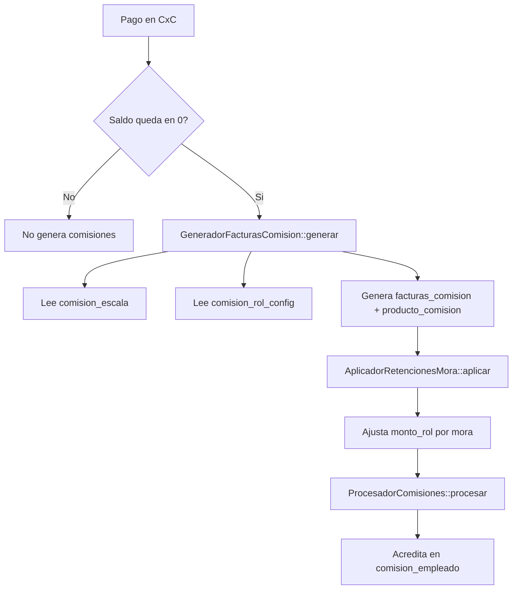

# MÓDULO: Comisiones / Configuración
### Análisis funcional ejecutivo completo — Incluye conexión total con Cuentas por Cobrar / Pagos

## 1) Alcance y objetivo real del modulo

URL funcional:
- /comisiones/configuracion

Clase principal:
- App\Http\Livewire\Comisiones\Escalado\Configuracion

Vista:
- resources/views/livewire/comisiones/escalado/configuracion.blade.php

Script principal:
- public/js/js_proyecto/comisiones/Escalado/gestionComision.js

Este modulo define las reglas maestras para calcular comisiones al cerrar facturas. Su funcion no es registrar pagos ni acreditar comisiones directamente. Su funcion es configurar parametros que despues son consumidos por el flujo de pagos en /cuentas_por_cobrar/pagos.

En terminos de dominio:
- Configuracion define "cuanto" y "quien puede calcular".
- Pagos decide "cuando se dispara" el calculo (al cerrar saldo/factura).

## 2) Entidades y tablas que gobierna

### 2.1 Tabla central: comision_escala

Cada fila representa una regla de comision por combinacion:
- rol_id
- cliente_categoria_escala_id
- categoria_precios_id
- porcentaje_comision
- estado_id

Significado:
- Si existe una fila activa para la combinacion rol + categoria de cliente + categoria de precio, ese rol puede comisionar productos de ese tipo.

### 2.2 Tabla de control de encendido/apagado: comision_rol_config

Campos relevantes:
- rol_id
- calcular (1/0)

Significado:
- calcular=1: el rol participa en el calculo automatico.
- calcular=0: el rol queda excluido aunque tenga escalas configuradas.

### 2.3 Tablas auxiliares usadas en configuracion

- rol
- cliente_categoria_escala
- categoria_precios
- users (auditoria de quien registra/modifica)

## 3) Rutas y endpoints del modulo configuracion

Vista y catalogos:
- GET /comisiones/configuracion
- GET /comisiones/configuracion/rol
- GET /comisiones/configuracion/categorias-precio
- GET /comisiones/configuracion/categorias-cliente-activas
- GET /comisiones/configuracion/cat-precio-para-filtro
- GET /comisiones/configuracion/roles-para-filtro

CRUD de parametros:
- POST /guardar/parametro/comision
- GET /listar/parametros/comision
- GET /parametro-comision/{id}
- POST /actualizar/parametro/comision/{id}
- POST /desactivar/parametro-comision/{id}

Carga masiva y selectiva:
- GET /comisiones/configuracion/plantilla-masiva
- POST /comisiones/configuracion/carga-masiva
- GET /comisiones/configuracion/plantilla-filtrada
- POST /comisiones/configuracion/preview-carga-filtrada
- POST /comisiones/configuracion/procesar-carga-filtrada

Indicadores y resumen:
- GET /comisiones/configuracion/stats
- GET /comisiones/configuracion/resumen-por-rol

Control de calculo por rol:
- GET /comisiones/configuracion/roles-calculo
- POST /comisiones/configuracion/roles-calculo/toggle

## 4) Logica funcional interna de Configuracion

## 4.1 Creacion de parametros (guardarParametroComision)

Entrada esperada:
- rol_id
- categoria_cliente_id
- nombre_comescala
- filas[] con:
  - categoria_precios_id
  - porcentaje

Comportamiento:
1. Valida datos minimos.
2. Recorre cada fila con porcentaje > 0.
3. Verifica duplicado activo por (rol, cat cliente, cat precio).
4. Si no existe, inserta en comision_escala.
5. Si ya existe, omite esa fila.
6. Retorna cantidad de registros insertados.

Regla importante:
- No permite duplicar configuracion activa para la misma combinacion.

## 4.2 Edicion y desactivacion

- actualizarParametro: modifica solo porcentaje_comision del registro.
- desactivarParametro: cambia estado_id a inactivo (2), sin borrado fisico.

Esto conserva historial y evita perdida de trazabilidad.

## 4.3 KPIs de configuracion (statsComision)

Calcula:
- activos
- inactivos
- roles distintos activos
- categorias cliente distintas activas
- promedio de porcentaje

Formula del promedio:

$$
porcentaje\_promedio = \frac{\sum porcentaje\_comision\_activo}{N\_registros\_activos}
$$

## 4.4 Resumen por rol y categoria cliente (resumenPorRol)

Agrupa por rol + categoria cliente y devuelve:
- total_configs
- pct_min
- pct_prom
- pct_max

Esto sirve para detectar dispersion de porcentajes por rol.

## 4.5 Carga masiva por Excel

### Export de plantilla

Clase:
- App\Exports\Comisiones\PlantillaComisionMasivaExport

Genera combinaciones activas de:
- rol x categoria_cliente_escala x categoria_precios

Incluye porcentaje actual si ya existe en comision_escala.

Columnas:
1) rol_id
2) Rol
3) cliente_categoria_id
4) Categoria Cliente
5) categoria_precio_id
6) Categoria Precio
7) % Comision (editar aqui)

### Import masivo

Clase:
- App\Imports\Comisiones\ComisionMasivaImport

Reglas:
- Si porcentaje <= 0 o vacio: omite.
- Si IDs no validos: omite y registra error.
- Si existe combinacion: actualiza y reactiva.
- Si no existe: inserta nuevo.

Contadores:
- insertados
- actualizados
- omitidos
- errores

## 4.6 Control de calculo por rol (toggleCalculoRol)

Mecanismo:
- Lee estado actual de comision_rol_config.calcular.
- Hace flip 1->0 o 0->1.
- Si no existe registro, crea uno.

Efecto real:
- Este estado es consumido por el generador de comisiones en Pagos.

## 5) Conexion completa con /cuentas_por_cobrar/pagos

Modulo conectado:
- URL: /cuentas_por_cobrar/pagos
- Clase: App\Http\Livewire\CuentasPorCobrar\Pagos
- Vista: resources/views/livewire/cuentas-por-cobrar/pagos.blade.php
- JS: public/js/js_proyecto/cuentas-por-cobrar/pagos.js

La conexion no es superficial. Es estructural y transaccional.

## 5.1 Momento en que Pagos usa Configuracion

Se usa cuando:
- un abono deja saldo en 0 (cierre automatico)
- o cierre manual de factura en pagos

En ese momento Pagos ejecuta:
1) GeneradorFacturasComision
2) AplicadorRetencionesMora
3) ProcesadorComisiones

Servicios:
- App\Services\Comisiones\GeneradorFacturasComision
- App\Services\Comisiones\AplicadorRetencionesMora
- App\Services\Comisiones\ProcesadorComisiones

## 5.2 Flujo tecnico de integracion

## 5.3 Reglas de roles/capacidades usadas por el generador

El generador crea targets por capacidad:
- Tipo 1: facturador con rol fijo de facturador.
- Tipo 2: facturador en su rol real (si aplica).
- Tipo 3: vendedor con rol fijo de vendedor.
- Tipo 4: gestor de entrega (si existe).

Luego:
- Deduplica por rol para no comisionar doble el mismo rol.
- Excluye roles con calcular=0 en comision_rol_config.
- Excluye roles sin escala activa en comision_escala.

Este punto es exactamente donde Configuracion manda sobre Pagos.

## 5.4 Formula de comision por linea y por rol

Por linea de producto:

$$
comision\_linea = precio\_unidad \times cantidad \times \frac{porcentaje\_comision}{100}
$$

Comision total del rol en la factura:

$$
monto\_rol = \sum comision\_linea
$$

Ese monto_rol se guarda en facturas_comision y luego puede acreditarse al acumulado mensual de comision_empleado.

## 5.5 Previsualizacion en Pagos antes de guardar

Endpoint:
- GET /pagos/preview-comisiones

Evalua:
- Si la factura ya tiene comisiones activas.
- Si el abono cerraria la factura.
- Que targets/roles participarian.
- Si esos roles tienen escala activa.
- Si esos roles estan deshabilitados para calculo.

Este preview usa las mismas reglas del generador, por eso es consistente con el resultado real.

## 5.6 Verificacion de periodo conciliado antes de guardar

Desde pagos.js se llama:
- GET /comisiones/conciliacion/verificar-periodo?fecha=YYYY-MM-DD

Si el periodo de pago ya esta conciliado:
- Se muestra advertencia.
- Se registra desvio de periodo en abonos_creditos.
- La comision se redirige al proximo periodo abierto.

Esto conecta Pagos con Conciliacion para preservar consistencia contable.

## 5.7 Reversion por anulacion de abono

Cuando se anula un pago:
- Se reabre factura si estaba cerrada.
- Se revierte facturas_comision (estado inactivo).
- Se revierte producto_comision asociado.
- Se descuenta comision_empleado.
- Se registra log en comision_reversiones.

Esto mantiene simetria entre configuracion/cierre y anulacion.

## 6) Formulas y reglas de negocio clave

## 6.1 Formula base de comision

$$
C = P \times Q \times \frac{r}{100}
$$

Donde:
- $P$ = precio unidad
- $Q$ = cantidad
- $r$ = porcentaje configurado en comision_escala

## 6.2 Acreditacion mensual

Para un usuario y rol en un mes:

$$
comision\_acumulada\_{mes} = \sum monto\_rol\_{facturas\_del\_mes}
$$

(Con filtros de periodo conciliado y estado activo)

## 6.3 Retencion por mora (aplicada en servicios)

Contado (fuera de gracia):

$$
comision\_final = 0
$$

Credito (acumulativa por periodos vencidos):

$$
periodos\_vencidos = \left\lfloor \frac{dias\_transcurridos}{dias\_gracia} \right\rfloor
$$

$$
retencion\_total = periodos\_vencidos \times subtotal\_factura \times \frac{porcentaje\_retencion}{100}
$$

$$
comision\_final = \max(0, comision\_original - retencion\_total)
$$

## 7) Validaciones funcionales que garantizan congruencia

- No duplica comisiones activas por factura (guardia en generador).
- No acredita en periodos conciliados (guardia en procesador).
- Toggle por rol aplica antes de calcular.
- Escalas inactivas no participan.
- Reversion de abono revierte comision acreditada y trazas.

## 8) Proposito del modulo dentro del sistema

/comisiones/configuracion es el modulo de gobierno de reglas de comision. Sin este modulo:
- Pagos podria cerrar facturas,
- pero no tendria reglas claras para generar montos por rol/categoria,
- ni control operacional para encender/apagar calculo por rol,
- ni carga masiva controlada para mantenimiento.

Por eso la conexion con /cuentas_por_cobrar/pagos es total:
- Configuracion define las reglas.
- Pagos dispara y ejecuta esas reglas.
- Servicios de comisiones materializan el resultado.

## 9) Resumen ejecutivo

- Configuracion administra escalas y control por rol.
- Pagos consume esas escalas al cerrar facturas.
- El calculo real se basa en porcentaje por rol + categoria de precio vendida.
- El sistema protege consistencia con conciliacion, retencion y reversion.
- La arquitectura es coherente: parametrizacion -> ejecucion -> auditoria -> reversa.
