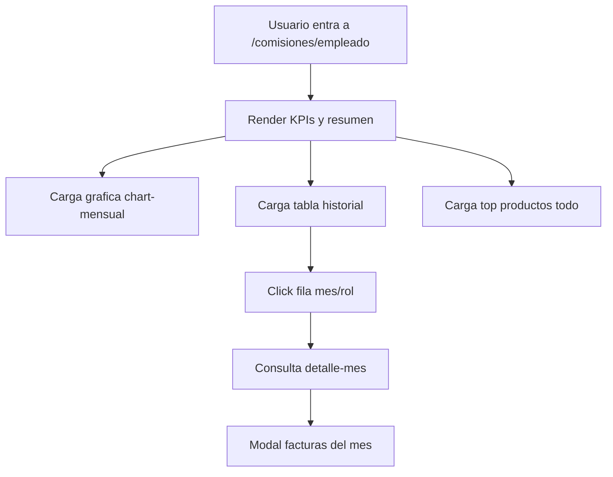

# Analisis Completo: Modulo Comisiones Empleado

## 1) Alcance

URL:
- /comisiones/empleado

Clase:
- App\Http\Livewire\Comisiones\Escalado\MisComisiones

Vista:
- resources/views/livewire/comisiones/escalado/mis-comisiones.blade.php

Script:
- public/js/js_proyecto/comisiones/Escalado/misComisiones.js

Este modulo es el tablero personal del empleado comisionado. Su funcion principal es presentar el historico y detalle de comisiones ya acreditadas para el usuario autenticado.

## 2) Objetivo funcional

Responde a tres preguntas de negocio:
1. Cuanto he comisionado historicamente y en el periodo actual.
2. En que meses y roles he tenido mejor rendimiento.
3. Que facturas/productos explican esos montos.

No genera ni recalcula comisiones. Solo consulta y visualiza datos acreditados.

## 3) Rutas y endpoints

- GET /comisiones/empleado
- GET /listar/empleado/comision
- GET /comision/empleado/top-productos
- GET /comision/empleado/chart-mensual
- GET /comision/empleado/detalle-mes

## 4) Fuentes de datos

Tablas principales:
- comision_empleado (acumulado mensual por usuario+rol)
- facturas_comision (comisiones por factura y rol)
- producto_comision (detalle por producto)
- users
- rol
- factura
- cliente
- producto

## 5) Render inicial (render)

El metodo render prepara:

1. Identidad de usuario:
- nombre
- id
- rol

2. KPIs globales:
- total_historico
- total_mes_actual
- total_anio_actual
- meses_activos
- facturas_totales
- facturas_mes_actual

3. Historico mensual para grafica:
- periodo YYYY-MM
- etiqueta corta (Ene 2026, etc.)
- suma de comision_acumulada

4. Mejor mes historico:
- mes con mayor suma de comision.

## 6) KPI y formulas

## 6.1 Total historico

$$
total\_historico = \sum comision\_acumulada\_{todos\_los\_meses}
$$

## 6.2 Mes actual

$$
total\_mes\_actual = \sum comision\_acumulada\_{mes\_actual}
$$

## 6.3 Anio actual

$$
total\_anio\_actual = \sum comision\_acumulada\_{anio\_actual}
$$

## 6.4 Promedio mensual (calculado en blade)

$$
promedio\_mensual = \frac{total\_historico}{meses\_activos}
$$

(si meses_activos = 0, promedio = 0)

## 6.5 Variacion mensual (calculado en blade)

Usa ultimo mes vs penultimo:

$$
variacion\_% = \frac{ultimo - penultimo}{penultimo} \times 100
$$

## 7) Tabla principal de historial (listarComisionesEmpleado)

Granularidad:
- una fila por mes + rol para el usuario actual.

Campos:
- mes en texto
- anio
- rol
- comision_acumulada
- cantidad_facturas
- fecha_ult_modificacion
- badge mes actual

Comportamiento UI:
- DataTable con export Excel.
- Al hacer click en una fila abre modal detalle de facturas del mes.

## 8) Grafica mensual (chartMensual)

Endpoint retorna serie ordenada por mes, usada en Chart.js.

Proposito:
- tendencia de comisiones en el tiempo.

## 9) Top productos (topProductos)

Filtro periodo:
- mes
- anio
- todo

Calcula por producto:
- unidades
- monto_total
- precio_promedio
- cantidad de facturas donde aparece

Formula de monto total por producto:

$$
monto\_total\_producto = \sum (monto\_comision \times cantidad)
$$

Orden:
- descendente por monto_total.

## 10) Detalle de facturas por mes (detalleFacturasMes)

Entrada:
- periodo YYYY-MM
- rol_id opcional

Salida por factura:
- id factura
- fecha cierre
- monto_rol
- rol
- cliente
- productos (conteo)
- unidades

Esta vista permite explicar de que facturas viene el total del mes/rol.

## 11) Estructura visual del modulo

La vista contiene:
- Hero con identidad y total historico.
- KPI cards (mes, mejor mes, anio, facturas, promedio, variacion).
- Grafica historica.
- Panel top productos con selector de periodo.
- Tabla historica mensual.
- Modal de detalle de facturas del mes.

## 12) Flujo usuario real

## 13) Diferencia con /comisiones/general

/comisiones/empleado:
- enfoque personal del usuario logueado,
- no requiere filtros complejos,
- combina resumen ejecutivo + detalle operativo personal.

/comisiones/general:
- enfoque administrativo y transversal,
- filtros por empleado/rol/fecha,
- reportes consolidados para supervision.

## 14) Puntos de consistencia del modelo

- Usa comision_empleado como fuente de acumulados.
- Usa facturas_comision para conteos y detalle.
- Mantiene separacion entre visualizacion y generacion de comisiones.

## 15) Consideraciones funcionales

- Si no hay datos del periodo, muestra estados vacios y mensajes claros.
- Si hay rol seleccionado en detalle-mes, restringe el detalle a ese rol.
- Export Excel disponible en historico.

## 16) Resumen ejecutivo

/comisiones/empleado es un dashboard personal de rendimiento de comisiones. Entrega trazabilidad desde KPI global hasta factura puntual, usando datos acreditados y sin alterar calculos. Es una capa de consulta y explicacion para el colaborador, orientada a transparencia de su pago variable.
