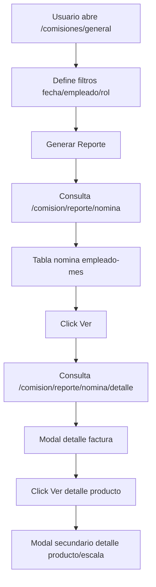

# Analisis Completo: Modulo Comisiones General

## 1) Alcance

URL:
- /comisiones/general

Clase:
- App\Http\Livewire\Comisiones\Escalado\ReportesComisionesGenerales

Vista:
- resources/views/livewire/comisiones/escalado/reportes-comisiones-generales.blade.php

Script:
- public/js/js_proyecto/comisiones/Escalado/reportesComisionesGenerales.js

## 2) Estado actual de la UI

Actualmente la vista se simplifico para mostrar solo la pestania de Nomina.

Visible:
- Nomina consolidada
- Modal detalle de nomina
- Modal secundario de detalle de productos por factura
- Export Excel desde ambos modales

Nota tecnica:
- El backend aun conserva endpoints de otros reportes (ranking, rol, facturas, productos, comparativo, reversiones), pero la interfaz principal esta enfocada solo en nomina.

## 3) Rutas del modulo

Catologos:
- GET /comision/empleados/lista
- GET /comision/roles/lista

Reportes:
- GET /comision/reporte/stats
- GET /comision/reporte/nomina
- GET /comision/reporte/nomina/detalle
- GET /comision/reporte/empleado
- GET /comision/reporte/rol
- GET /comision/reporte/usuarios
- GET /comision/reporte/productos
- GET /comision/reporte/facturas
- GET /comision/reporte/ranking
- GET /comision/reporte/comparativo
- GET /comision/reporte/reversiones
- GET /comision/reporte/excel

## 4) Entrada de filtros y normalizacion

Filtros base:
- fechaInicio
- fechaFin
- empleado_id (opcional)
- rol_id (opcional)

Normalizacion backend:
- Soporta Y-m-d, d/m/Y, m/d/Y.
- Si falta fecha, usa fecha actual.

Normalizacion frontend:
- Convierte formatos ambiguos a YYYY-MM-DD antes de enviar.

## 5) Logica central: reporteNomina

## 5.1 Objetivo

Construir una nomina consolidada por:
- empleado
- mes

Datos mostrados:
- roles en los que comisiono
- facturas comisionadas
- comision total

## 5.2 Regla critica de mapeo de usuario real

Para contar facturas del empleado correcto, usa CASE por tipo_comision:
- tipo 1 -> factura.users_id
- tipo 2 -> factura.users_id
- tipo 3 -> factura.vendedor
- tipo 4 -> factura.gestor_entrega

Esta regla evita inflar conteos y asegura congruencia con acreditaciones reales.

## 5.3 Fuente de montos

- El monto de nomina sale de comision_empleado.comision_acumulada, agrupado por empleado+mes.
- Facturas comisionadas se obtiene de facturas_comision agregadas por usuario real + mes.

## 5.4 Formula principal

Para empleado $u$ en mes $m$:

$$
comision\_total(u,m) = \sum comision\_acumulada\_{(u,m,rol)}
$$

$$
facturas\_comisionadas(u,m) = \#\{factura\_id\_distinta\}\_{mapeada\_a\_u\_en\_m}
$$

## 6) Logica detalleNomina (modal principal)

Entrada:
- empleado_id
- mes_clave (YYYY-MM)

Proceso:
1. Obtiene roles activos del empleado en ese mes desde comision_empleado.
2. Busca facturas_comision del mes para ese empleado (mapeo por tipo_comision).
3. Calcula por factura:
   - comision_original (suma producto_comision)
   - retencion_aplicada (retencion_mora_monto)
   - comision_final (monto_rol)
   - estado (ACTIVA/REVERTIDA)
4. Agrega observaciones de reversa desde comision_reversiones.
5. Construye resumen y detalle de productos por factura.

## 6.1 Formula de conciliacion interna de detalle

Por factura comisionada:

$$
comision\_original = \sum (monto\_comision \times cantidad)\_{lineas\_producto}
$$

$$
comision\_final = monto\_rol
$$

$$
retencion\_aplicada = comision\_original - comision\_final\ \text{(si aplica mora)}
$$

## 6.2 Detalle de producto y escala

Para cada linea de producto en el modal secundario se expone:
- producto
- categoria_cliente_escala
- categoria_precio_vendida
- porcentaje_comision
- cantidad
- precio_venta
- comision

El porcentaje mostrado se consulta de comision_escala por:
- rol de la factura
- categoria_precios_id de la venta
- estado activo

## 7) Exportaciones del modulo

## 7.1 Export Excel detalle nomina

Desde modal detalle principal:
- exporta factura, cliente, fecha, rol, original, retencion, final, resumen, estado, observaciones.
- formatea columnas monetarias en L.

## 7.2 Export Excel detalle productos factura

Desde modal secundario:
- exporta producto, categoria cliente, categoria precio, porcentaje, cantidad, precio, comision.
- aplica formato de porcentaje y moneda.

## 8) KPI stats del modulo (endpoint stats)

Calcula:
- total_comision
- total_facturas
- total_empleados
- total_retenido
- total_revertido

## 8.1 Formula de total revertido

Lee comision_reversiones.comisiones_revertidas (JSON) y suma por item:

$$
total\_revertido = \sum monto\_revertido\_{items\_json}
$$

Con filtros opcionales por empleado y rol.

## 9) Otros reportes backend (aunque no visibles hoy)

El backend aun soporta:
- reporteEmpleado
- reporteRol
- reporteUsuarios
- reporteProductos
- reporteFacturas
- reporteRanking
- reporteComparativo
- reporteReversiones

Esto permite volver a habilitar esas vistas sin rehacer consultas base.

## 10) Congruencia funcional del modulo

El modulo general esta alineado con las tablas de ejecucion real de comisiones:
- comision_empleado para acumulados.
- facturas_comision/producto_comision para trazabilidad.
- comision_reversiones para auditoria de anulaciones.
- retencion_mora_log/facturas_comision para impacto por mora.

Punto fuerte actual:
- Nomina y detalle utilizan mapeo de usuario real por tipo_comision, evitando desfaces entre consolidado y detalle.

## 11) Flujo funcional actual en UI

## 12) Proposito del modulo en arquitectura

/comisiones/general es la capa de supervision y auditoria operativa de comisiones. Su valor es:
- consolidar pagos variables por periodo,
- explicar el numero con trazabilidad hasta producto,
- exponer retenciones y reversiones,
- facilitar cierre de nomina con evidencia.

## 13) Resumen ejecutivo

El modulo general actualmente opera en modo focalizado de Nomina, con congruencia entre consolidado y detalle y con exportes operativos. Mantiene backend preparado para analitica ampliada, pero la experiencia visible esta centrada en la vista de mayor valor de control: empleado-mes-factura-producto.
