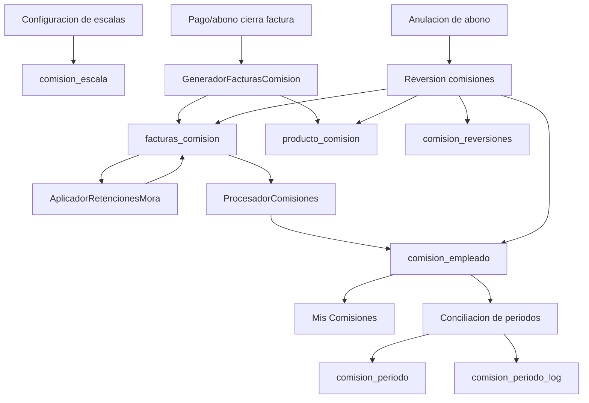

# Analisis detallado: Comisiones Escaladas + Cuentas por Cobrar/Pagos

Fecha: 2026-06-12

## 1. Alcance analizado

Se analizo en detalle el funcionamiento de estos modulos:

- /comisiones/configuracion
- /comisiones/empleado
- /cuentas_por_cobrar/pagos
- /comisiones/conciliacion

Y su integracion real (frontend + backend + servicios + SP SQL):

- configuracion de escalas por rol y categoria de precio
- generacion de comisiones al cerrar factura
- retenciones por mora
- acreditacion a comision_empleado por periodo mensual
- conciliacion/reapertura de periodos
- reversion de comisiones al anular abonos

## 2. Mapa funcional general

## 3. Tablas clave y rol de cada una

- comision_escala
  - Parametros de porcentaje por combinacion: rol_id + cliente_categoria_escala_id + categoria_precios_id.
  - Solo estado_id=1 participa en calculo.

- comision_rol_config
  - Interruptor por rol: calcular=1 habilitado, calcular=0 deshabilitado.
  - Si no existe fila para un rol, el sistema lo asume habilitado.

- facturas_comision
  - Resultado por factura y por rol (monto_rol), con tipo_comision (1,2,3,4).
  - Estado activo/inactivo para trazabilidad y reversas.

- producto_comision
  - Detalle por linea de producto comisionada, enlazado a facturas_comision_id.

- comision_empleado
  - Acumulado mensual por (users_comision, rol_id, mes_comision).
  - Este es el saldo de comision que ve el empleado.

- comision_periodo
  - Control de cierre mensual de comisiones.
  - estado: 0 abierto, 1 conciliado.

- comision_periodo_log
  - Auditoria de conciliacion/reapertura con snapshots completos.

- dias_gracia_comision
  - Configuracion por rol y tipo_factura (contado/credito): dias_gracia y porcentaje_retencion.

- retencion_mora_log
  - Trazabilidad de retenciones aplicadas por mora.

- comision_reversiones
  - Log de anular pagos y comisiones revertidas.

- aplicacion_pagos (SP)
  - Estado financiero de la factura para CxC: saldo, abonos, notas, movimientos, cierre.

## 4. Modulo /comisiones/configuracion

## 4.1 Que hace

Permite administrar la matriz de comisiones escaladas por:

- rol
- categoria de cliente
- categoria de precio
- porcentaje_comision

Tambien controla:

- carga masiva/selectiva por Excel
- KPIs de configuracion
- resumen por rol
- habilitar/deshabilitar calculo de comisiones por rol (comision_rol_config)

## 4.2 Regla central de configuracion

La unidad de configuracion efectiva es:

(rol_id, cliente_categoria_escala_id, categoria_precios_id) -> porcentaje_comision

Solo filas activas (estado_id=1) son elegibles en calculo.

## 4.3 Validaciones operativas

- No crea duplicados activos para la misma combinacion.
- Si una combinacion existe, en carga masiva se actualiza y re-activa.
- Porcentaje <= 0 se omite en import.
- Se puede desactivar parametro puntual (estado_id=2).

## 4.4 Export/Import

- Plantilla exporta todas las combinaciones activas de:
  - rol x categoria_cliente x categoria_precio
- Columna editable: % Comision.
- Import:
  - preview: cuenta nuevos/existentes/omitidos
  - proceso: inserta o actualiza en comision_escala

## 4.5 Control de roles de calculo

- Endpoint de toggle hace upsert en comision_rol_config.
- Efecto real: al generar comisiones se filtran roles con calcular=0.

## 5. Modulo /comisiones/empleado

## 5.1 Que muestra

Vista de autoservicio del empleado con:

- KPIs historicos/mes/anio
- grafica mensual (comision_empleado)
- top productos (producto_comision + facturas_comision)
- historial mensual por rol
- detalle de facturas por mes

## 5.2 Origen del dato

La vista no recalcula comision; consume acumulados ya acreditados en comision_empleado y detalle de facturas_comision/producto_comision.

## 5.3 Agrupacion usada

- Una fila por mes + rol en historial.
- Conteo de facturas por rol y mes desde facturas_comision activa.

## 6. Modulo /cuentas_por_cobrar/pagos (core de integracion)

Este modulo es el punto donde nace y muere la comision en la operacion real.

## 6.1 Que operaciones maneja

- Inicializacion/sincronizacion de aplicacion_pagos con facturas (SP accion 1,2,3)
- Retencion ISV (SP accion 4)
- Nota de credito (SP accion 5)
- Nota de debito (SP accion 6)
- Otros movimientos (SP accion 7)
- Abonos/pagos (SP accion 8)
- Cierre de factura (SP accion 9)
- Preview de comisiones antes de guardar pago
- Anulacion de abonos con reversion de comisiones

## 6.2 Formula financiera base de saldo (aplicacion_pagos)

A nivel funcional, el saldo queda modelado por:

Saldo = total_factura_cargo
      - total_notas_credito
      + total_nodas_debito
      + movimiento_suma
      - movimiento_resta
      - credito_abonos
      - retencion_aplicada_efectiva

Donde varias componentes se actualizan por SP segun accion.

## 6.3 Momento de generacion de comision

Se dispara cuando la factura queda cerrada por saldo 0 (automatico o cierre manual).

Flujo real:

1. Se aplica pago/ajuste en aplicacion_pagos.
2. Si saldo <= 0:
   - se normaliza saldo a 0
   - se marca estado_cerrado=2
3. Se invoca GeneradorFacturasComision->generar(...)
4. Se aplica AplicadorRetencionesMora->aplicar(...)
5. Se acredita ProcesadorComisiones->procesar(...)

## 6.4 Preview antes de confirmar pago

El frontend consulta /pagos/preview-comisiones para anticipar:

- si el pago cerrara factura
- si ya estaba comisionada
- que capacidades/roles recibirian comision

Capacidades mostradas:

- Facturador fijo (tipo 1, rol fijo 3)
- Rol real facturador (tipo 2, condicional)
- Vendedor (tipo 3, rol fijo 2)

Luego filtra a roles con escala activa.

## 6.5 Integracion con conciliacion de periodos (muy importante)

Antes de guardar abono, frontend llama:

- /comisiones/conciliacion/verificar-periodo?fecha=YYYY-MM-DD

Si el mes de fecha_pago esta conciliado:

- usuario confirma desvio
- se guarda en abono:
  - periodo_comision_original
  - periodo_comision_asignado (proximo abierto)
- al generar comision se usa fechaPagoComision = periodo_comision_asignado (inicio de mes)

Resultado:

No se acredita en mes cerrado; se desplaza al siguiente periodo abierto con trazabilidad.

## 6.6 Anulacion de abono y reversion de comisiones

Al anular:

1. abonos_creditos.estado_abono -> 0
2. aplicacion_pagos.saldo += monto_abonado
3. si estaba cerrada, se reabre (estado_cerrado=0)
4. si cliente tiene credito_inicial, credito -= monto
5. Se buscan facturas_comision activas de esa factura
6. Por cada una:
   - comision_empleado.comision_acumulada = max(0, acumulada - monto_rol)
7. facturas_comision.estado_id -> 2
8. producto_comision.estado_id -> 2
9. Se registra comision_reversiones con detalle JSON

Formula de reversa por empleado/rol:

comision_acumulada_nueva = max(0, comision_acumulada_actual - monto_rol_revertido)

## 7. Motor de calculo de comisiones

## 7.1 GeneradorFacturasComision (regla principal)

Para cada factura cerrada, construye targets por rol/capacidad.

Roles fijos usados:

- ROL_FACTURADOR_ID = 3
- ROL_VENDEDOR_ID = 2
- ROL_GESTOR_ENTREGA_ID = 16

Tipos:

- 1 facturador fijo
- 2 facturador en rol real
- 3 vendedor
- 4 gestor de entrega

### Deduplicacion por rol

Si se repite rol entre capacidades, conserva una sola entrada por rol.
Prioriza mayor tipo numerico (4 > 3 > 2 > 1).

### Filtro por rol habilitado

Excluye roles con comision_rol_config.calcular = 0.

### Cruce con escala

Cada linea de venta (venta_has_producto + precios_producto_carga.categoria_precios_id) se cruza con comision_escala por clave:

rol_id + categoria_precios_id

Si no hay escala para esa combinacion, esa linea no aporta comision para ese rol.

### Formula de linea

monto_linea = precio_unidad x cantidad x (porcentaje_comision / 100)

### Formula de total por rol en factura

monto_rol = suma de monto_linea de todas las lineas elegibles para ese rol

Se inserta en facturas_comision y detalle en producto_comision.

## 7.2 AplicadorRetencionesMora

Aplica despues de generar y antes de acreditar.

### Caso contado

- referencia: fecha_emision
- dias_transcurridos = fecha_cierre - fecha_emision
- si dias_transcurridos > dias_gracia => retencion total

Formula:

comision_final = 0
monto_retenido = comision_original

### Caso credito

- referencia: fecha_vencimiento
- periodos_vencidos = floor(dias_transcurridos / dias_gracia)
- monto_por_periodo = comision_original_rol x (porcentaje_retencion / 100)
- total_retencion = periodos_vencidos x monto_por_periodo
- comision_final = max(0, comision_original - total_retencion)
- solo aplica a roles con configuracion activa en dias_gracia_comision para tipo_factura=credito

Tambien registra bitacora detallada en retencion_mora_log.

## 7.3 ProcesadorComisiones

Acredita en comision_empleado por llave:

(users_comision, rol_id, mes_comision, estado_id=1)

Pero antes valida bloqueo de periodo:

- si comision_periodo.estado=1 para ese mes -> NO acredita

Formula de acumulado:

comision_acumulada_mes = comision_acumulada_mes + monto_rol_final

## 8. Modulo /comisiones/conciliacion

## 8.1 Que hace

Gestiona cierre contable mensual de comisiones:

- valida salud de configuracion
- lista periodos (abierto, conciliado, sin_abrir)
- concilia periodo (snapshot)
- reabre periodo
- detalle por periodo
- auditoria historica
- administracion de dias de gracia por rol

## 8.2 Estados y efecto

- abierto: permite nuevas acreditaciones
- conciliado: bloquea acreditaciones nuevas en comision_empleado
- sin_abrir: meses futuros

El bloqueo real lo ejecuta ProcesadorComisiones consultando comision_periodo.

## 8.3 Conciliar periodo

Al conciliar:

1. calcula snapshot live del mes:
   - total comision
   - cantidad empleados
   - cantidad facturas
   - detalle empleados/facturas
2. guarda/actualiza comision_periodo estado=1
3. guarda auditoria en comision_periodo_log (accion conciliacion)

## 8.4 Reabrir periodo

- requiere observacion
- cambia comision_periodo.estado=0
- limpia metadatos de conciliacion en cabecera
- registra log con snapshot (accion reapertura)

## 8.5 Verificacion de periodo para pagos

Endpoint verificarPeriodoPago:

- recibe fecha
- verifica si su mes esta conciliado
- si esta conciliado, calcula proximo abierto hasta 24 meses

Este endpoint es el puente directo entre Conciliacion y Pagos.

## 9. Donde se unen exactamente los 4 modulos

Union 1: Configuracion -> Pagos/Generacion

- comisiones/configuracion alimenta comision_escala y comision_rol_config.
- pagos (al cerrar factura) consume esas tablas para calcular.

Union 2: Pagos -> Empleado

- pagos genera facturas_comision/producto_comision y luego acumula en comision_empleado.
- comisiones/empleado lee comision_empleado + detalle para mostrar dashboard.

Union 3: Conciliacion -> Pagos

- pagos consulta verificar-periodo antes de registrar abono.
- si periodo cerrado, desplaza acreditacion al proximo periodo abierto.

Union 4: Conciliacion -> Procesador

- ProcesadorComisiones bloquea acreditacion si mes conciliado.
- garantiza integridad de cierre mensual.

Union 5: Pagos (anulacion) -> Empleado/Conciliacion

- anular abono revierte comisiones (facturas_comision/producto_comision/comision_empleado).
- mantiene log forense en comision_reversiones.

## 10. Formulas consolidadas

## 10.1 Comision por linea de producto

Comision_linea = Precio_unidad x Cantidad x (Porcentaje_comision / 100)

## 10.2 Comision por rol en una factura

Comision_rol_factura = sumatoria de Comision_linea (lineas con escala aplicable al rol)

## 10.3 Comision final despues de mora

### Contado

Si dias_atraso > dias_gracia:

Comision_final = 0

### Credito

Periodos_vencidos = floor(Dias_atraso / Dias_gracia)
Retencion_total = Periodos_vencidos x (Comision_original_rol x Porcentaje_retencion/100)
Comision_final = max(0, Comision_original - Retencion_total)

## 10.4 Acumulado mensual por empleado y rol

Comision_acumulada_mes = Comision_acumulada_mes + Comision_final_factura

(Se aplica solo si el periodo no esta conciliado)

## 10.5 Reversion por anulacion de pago

Comision_acumulada_mes_nueva = max(0, Comision_acumulada_mes_actual - Comision_rol_factura)

## 10.6 Saldo financiero de CxC (modelo funcional)

Saldo = Cargo - NC + ND + Movimientos_suma - Movimientos_resta - Abonos - Retenciones_aplicadas

## 11. Riesgos/observaciones de negocio detectadas

1. Un rol solo puede comisionar una vez por factura (deduplicacion por rol), aunque participen varias personas con ese mismo rol en capacidades distintas.
2. Si se desactiva un rol en comision_rol_config, deja de generar comision aunque tenga escala definida.
3. La reapertura de periodo no borra historial: lo conserva en comision_periodo_log (correcto para auditoria).
4. El flujo de pago en periodo conciliado depende de confirmacion de usuario para desviar al siguiente periodo abierto.
5. La anulacion de abono puede impactar comisiones historicas ya visualizadas por el empleado (porque las descuenta y marca facturas_comision inactivas).

## 12. Referencias tecnicas principales

Backend Livewire:

- app/Http/Livewire/Comisiones/Escalado/Configuracion.php
- app/Http/Livewire/Comisiones/Escalado/MisComisiones.php
- app/Http/Livewire/Comisiones/Escalado/Conciliacion.php
- app/Http/Livewire/CuentasPorCobrar/Pagos.php

Servicios de comision:

- app/Services/Comisiones/GeneradorFacturasComision.php
- app/Services/Comisiones/AplicadorRetencionesMora.php
- app/Services/Comisiones/ProcesadorComisiones.php

Frontend JS:

- public/js/js_proyecto/comisiones/Escalado/gestionComision.js
- public/js/js_proyecto/comisiones/Escalado/misComisiones.js
- public/js/js_proyecto/cuentas-por-cobrar/pagos.js
- resources/views/livewire/comisiones/escalado/conciliacion.blade.php

SQL y rutas:

- MISELANIOS/sp/sp_aplicacion_pagos.sql
- routes/web.php

## 13. Conclusiones ejecutivas

- El calculo de comisiones esta fuertemente acoplado al cierre de factura en CxC/Pagos.
- Conciliacion no calcula comisiones; gobierna cuando se pueden acreditar.
- Configuracion define quien y cuanto puede comisionar; Pagos ejecuta; Empleado visualiza; Conciliacion controla corte contable.
- El sistema ya incluye trazabilidad robusta para auditoria (periodos, retenciones y reversiones).
