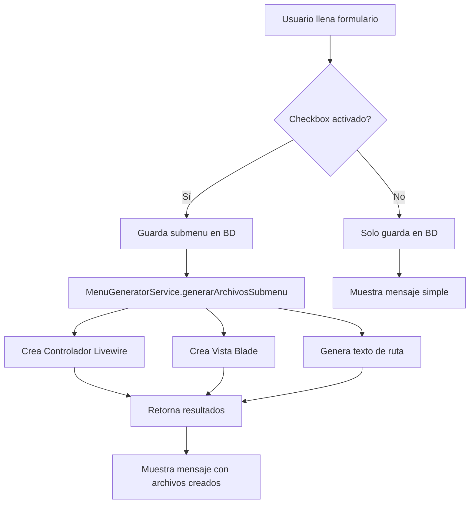

# 🎉 Solución Implementada - Generación Automática de Archivos para Menús

## 📝 Resumen del Problema

**Problema reportado:**
> "Cuando creo un menú este no me crea la ruta ni la vista ni el back"

El sistema de menús dinámicos solo guardaba los menús en la base de datos, pero **NO** creaba automáticamente:
- ❌ El controlador/componente Livewire
- ❌ La vista Blade
- ❌ La ruta en `web.php`

## ✅ Solución Implementada

Se ha creado un sistema completo de **generación automática de archivos** que ahora:

### 1. Crea el Controlador Livewire automáticamente
**Ubicación**: `app/Http/Livewire/[Carpeta]/[Clase].php`

**Contenido generado**:
- ✅ Namespace correcto basado en la URL
- ✅ Estructura básica del componente
- ✅ Método `render()` configurado
- ✅ Métodos de ejemplo: `listarDatos()`, `guardar()`
- ✅ Manejo de errores y transacciones DB

### 2. Crea la Vista Blade automáticamente
**Ubicación**: `resources/views/livewire/[carpeta]/[archivo].blade.php`

**Contenido generado**:
- ✅ Layout completo con breadcrumbs
- ✅ Alertas de sesión (success/error)
- ✅ Estructura de tabla con DataTables
- ✅ Botón de "Nuevo" con modal
- ✅ Sección de scripts preparada

### 3. Genera el texto de la Ruta
**Formato**: `Route::get('/url', App\Http\Livewire\Clase::class);`

**Nota**: Por seguridad, la ruta **NO** se inserta automáticamente en `web.php`. El sistema genera el texto que debes copiar y pegar manualmente.

## 📂 Archivos Creados/Modificados

### Nuevos Archivos

1. **`app/Services/MenuGeneratorService.php`** (358 líneas)
   - Servicio principal para la generación de archivos
   - Métodos:
     - `generarArchivosSubmenu()` - Orquesta la generación
     - `crearControladorLivewire()` - Crea el controlador
     - `crearVistaBlade()` - Crea la vista
     - `generarTextoRuta()` - Genera el texto de la ruta

2. **`MENU_AUTO_GENERACION_README.md`** (Documentación completa)
   - Guía de uso paso a paso
   - Convenciones de nombres
   - Solución de problemas
   - Ejemplos de uso

3. **`PRUEBAS_AUTO_GENERACION.md`** (Guía de pruebas)
   - Prueba rápida del sistema
   - Casos de prueba adicionales
   - Checklist de verificación

### Archivos Modificados

1. **`app/Http/Controllers/MenuController.php`**
   - ✅ Inyección del servicio `MenuGeneratorService`
   - ✅ Método `guardarSubmenu()` actualizado para generar archivos
   - ✅ Parámetro opcional `generar_archivos`
   - ✅ Respuesta con información de archivos generados

2. **`resources/views/livewire/menu/gestion-menu.blade.php`**
   - ✅ Nuevo checkbox: "Generar archivos automáticamente"
   - ✅ Texto de ayuda informativo
   - ✅ Activado por defecto

3. **`public/js/js_proyecto/menu/gestion-menu.js`**
   - ✅ Función `abrirModalSubmenu()` actualizada
   - ✅ Función `guardarSubmenu()` actualizada
   - ✅ Envío del parámetro `generar_archivos`
   - ✅ Mensaje mejorado con detalles de archivos generados

## 🚀 Cómo Funciona

### Flujo de Trabajo



### Ejemplo de Uso

**Input del usuario:**
```
Nombre: Gestión de Productos
URL: inventario/productos
Generar archivos: ✅ Activado
```

**Output del sistema:**
```
✅ Submenu creado correctamente - Se generaron 2 archivo(s).

📁 Archivos creados:
✓ app/Http/Livewire/Inventario/Productos.php
✓ resources/views/livewire/inventario/productos.blade.php

🔗 Agrega esta ruta a routes/web.php:
Route::get('/inventario/productos', App\Http\Livewire\Inventario\Productos::class);
```

## 🎯 Ventajas de la Solución

### Para Desarrolladores
1. ⚡ **Ahorro de tiempo**: No más copiar/pegar archivos base
2. 📏 **Consistencia**: Todos los archivos siguen el mismo patrón
3. 🛡️ **Seguridad**: No sobrescribe archivos existentes
4. 📝 **Documentación**: Código generado incluye comentarios TODO

### Para el Sistema
1. 🔄 **Escalable**: Fácil agregar nuevos módulos
2. 🎨 **Flexible**: Checkbox opcional para casos especiales
3. ✅ **Robusto**: Manejo de errores completo
4. 📊 **Trazable**: Logs de archivos creados

## 🔧 Configuración Requerida

### Paso 1: Autoload de Composer
```bash
cd c:\laragon\www\Valencia\PROFAC\SISTEMA\profac-app
composer dump-autoload
```

### Paso 2: Permisos de Escritura
Asegurar permisos en:
- `app/Http/Livewire/`
- `resources/views/livewire/`

### Paso 3: Prueba Inicial
1. Ve a `/menu/gestion`
2. Crea un submenu de prueba
3. Verifica archivos generados
4. Agrega la ruta a `web.php`

## 📖 Documentación

Consulta los siguientes archivos para más información:

- **`MENU_AUTO_GENERACION_README.md`**: Guía completa de uso
- **`PRUEBAS_AUTO_GENERACION.md`**: Guía de pruebas
- **`SISTEMA_MENU_DINAMICO_README.md`**: Sistema de menús dinámicos (ya existente)

## 🎓 Ejemplos de Código Generado

### Controlador Livewire Generado
```php
<?php

namespace App\Http\Livewire\Inventario;

use Livewire\Component;
use Illuminate\Support\Facades\DB;
use Illuminate\Support\Facades\Auth;

class Productos extends Component
{
    public $titulo = 'Gestión de Productos';

    public function mount() { }

    public function render()
    {
        return view('livewire.inventario.productos');
    }

    public function listarDatos()
    {
        try {
            // TODO: Implementar lógica de listado
            $datos = DB::table('tu_tabla')->get();
            
            return response()->json([
                'success' => true,
                'data' => $datos
            ], 200);
        } catch (\Exception $e) {
            return response()->json([
                'success' => false,
                'mensaje' => 'Error: ' . $e->getMessage()
            ], 500);
        }
    }
}
```

### Vista Blade Generada
```blade
<div>
    <div class="row wrapper border-bottom white-bg page-heading">
        <div class="col-lg-10">
            <h2>Gestión de Productos</h2>
            <ol class="breadcrumb">
                <li class="breadcrumb-item">
                    <a href="{{ route('dashboard') }}">Inicio</a>
                </li>
                <li class="breadcrumb-item active">
                    <strong>Gestión de Productos</strong>
                </li>
            </ol>
        </div>
    </div>

    <div class="wrapper wrapper-content animated fadeInRight">
        <!-- Alertas y contenido -->
        <div class="row">
            <div class="col-lg-12">
                <div class="ibox">
                    <div class="ibox-title">
                        <h5>Gestión de Productos</h5>
                        <div class="ibox-tools">
                            <button type="button" class="btn btn-primary btn-sm">
                                <i class="fa fa-plus"></i> Nuevo
                            </button>
                        </div>
                    </div>
                    <div class="ibox-content">
                        <!-- Tabla DataTables -->
                    </div>
                </div>
            </div>
        </div>
    </div>
</div>
```

## ⚠️ Consideraciones Importantes

1. **Los archivos generados son plantillas básicas**
   - Incluyen la estructura pero requieren personalización
   - Debes agregar la lógica de negocio específica

2. **La ruta debe agregarse manualmente**
   - Por seguridad, no se modifica `web.php` automáticamente
   - Copia el texto generado y pégalo en el archivo de rutas

3. **No sobrescribe archivos existentes**
   - Si el controlador o vista ya existe, muestra advertencia
   - Protege código existente de ser sobrescrito

4. **Convenciones de nombres**
   - La URL determina la estructura de carpetas
   - Ejemplo: `usuarios/listar` → `Usuarios\Listar.php`

## 🐛 Debugging

Si algo no funciona:

1. **Verifica el autoload**: `composer dump-autoload`
2. **Revisa permisos** de carpetas
3. **Verifica que agregaste la ruta** en `web.php`
4. **Consulta los logs** de Laravel: `storage/logs/laravel.log`

## 🔄 Próximas Mejoras Sugeridas

- [ ] Generador de modelos Eloquent
- [ ] Generador de migraciones
- [ ] Templates personalizables
- [ ] Generador de pruebas unitarias
- [ ] CLI para generar desde terminal
- [ ] Registro automático de rutas (opcional)

## 📞 Soporte

Para dudas o problemas:
1. Consulta la documentación: `MENU_AUTO_GENERACION_README.md`
2. Sigue la guía de pruebas: `PRUEBAS_AUTO_GENERACION.md`
3. Revisa errores en: `storage/logs/laravel.log`

---

**Fecha de implementación**: 15 de Diciembre de 2025  
**Versión**: 1.0.0  
**Estado**: ✅ Funcional y listo para usar
